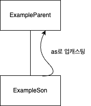
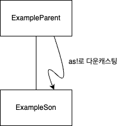

스위프트에서 코드를 작성할때 컴파일러가 어떤 값의 특정 타입을 식별하지 못할때가 생긴다. 

이때 어떻게 해결해야할까?

타입 캐스팅을 사용해서 의도한 타입을 컴파일러에게 알려줄 수 있다.

오늘은 타입 캐스팅에 대해서 자세하게 알아보자.

## 🔄 **타입 캐스팅이란?**
타입 캐스팅이란 **반환값에 타입이 불분명할때 의도한 타입을 컴파일러가 알 수 있게 해주는 것**이다.

타입 캐스팅엔 **업캐스팅**과, **다운캐스팅**이 존재하는데 지금부터 이게 무엇인지에 대해서 알아보자.

### 업캐스팅
어떤 상위 클래스와 그에 속하는 하위 클래스가 있다고 가정할때 **하위 클래스를 상위 클래스로 변환하는 것**을 말한다.

따로 프로그래미을 공부한 적이 없다면 말이 좀 어렵다고 느껴질 수도 있다.
(내가 설명을 잘 못하는걸수도..)

예시를 들면서 마저 설명하겠다.
업캐스팅을 하는 방법은 **as 키워드를 사용하는 것**이다.

ExampleParent 라는 상위 클래스에 ExampleSon 이라는 하위 클래스가 속해있다고 생각해보자.



위 이미지 처럼 하위 클래스가 상위 클래스로 변환 되는 것이다.

**업캐스팅 사용**
```swift
var exampleSon: ExampleSon = ExampleSon()
var exampleParent: ExampleParent = exampleSon as ExampleParent
```
위 코드처럼 as 키워드를 사용하여 업캐스팅을 할 수 있다.

하위 클래스가 상위 클래스로 변환되는 과정은 안전성이 확보된다.
다음으로는 다운 캐스팅에 대해서 알아보자.

### 다운 캐스팅
**어떤 클래스에서 다른 클래스로 만드는 변환이 일어날때 발생**한다.

**보통 상위 클래스를 하위 클래스로 변환**하는데 안전하게 수행되거나 유효하지 않은 변환 시도가 일어나더라도 컴파일러가 알아서 걸러내준다는 보장이 없기 때문에 **안전성이 보장되지 않는다**.

다운캐스팅은 as! 키워드를 사용한다.



위 이미지 처럼 ExampleParent라는 상위 클래스가 ExampleSon이라는 하위 클래스로 변환된다.

코드로 확인해보자.

**다운캐스팅 사용법**
```swift
var exampleParent: ExampleParent = ExampleParent()
var exampleSon: ExampleSon = exampleParent as! ExampleSon // error: Execution was interrupted, reason: signal SIGABRT.
```

위 코드처럼 as! 키워드를 사용해서 다운캐스팅읋 한다.
그럼 Error가 발생하는데.. 이처럼 **다운캐스팅은 위험 부담이 굉장히 크다**.

> error: Execution was interrupted, reason: signal SIGABRT. <br>잘못된 타입 캐스팅으로 인한 에러

이러한 위험성을 조금 줄일 방법이 없을까??

다행히도 Swift에는 **as? 키워드를 이용한 옵셔널 바인딩을 사용해서 다운캐스팅에 위험을 줄일 수 있다**.

### 옵셔널 바인딩 다운 캐스팅
반환에 성공할 경우 지정된 타입의 옵셔널 값이 반환되며 실패시 nil 값이 반환되게 한다.

```swift
if let exampleSon = exampleParent as? ExampleSon{
    print("다운캐스팅 성공")
}else{
    print("다운캐스팅 실패")
}
```

실행 결과
```
다운캐스팅 실패
```

이렇게 as? 키워드와 옵셔널 바인딩을 사용하면 다운캐스팅의 위험도를 줄일 수 있다. (이정도면 안쓰는게 맞는거 같기도 하다..좀 더 공부해봐야 알듯..)

## 🗂️ **정리**
컴파일러가 반환 값의 타입을 식별하지 못할땐 타입 캐스팅을 이용해서 반환 타입을 알려줄 수 있다. 

업캐스팅: 하위 객체를 상위 객체로 변환
- as 키워드 사용
- 안전성 O

다운 캐스팅: 상위 객체를 하위 객체로 변환
- as! 키워드 사용
- 안전성 X

다운 캐스팅의 위험성을 줄이기 위한 방법으로는 as? 키워드와 옵셔널 바인딩을 사용해서 어느정도 커버가 가능하다.

## 💭 **느낀점**
Swift 공부를 계속 하면서 Swift가 타입에 대해서 정말 진심이구나..하는 생각이 많이 든다.. 

또한 컴파일러가 타입을 인식하지 못할땐 타입 캐스팅을 사용해서 타입을 컴파일러에게 알려줄 수 있다는 것을 새로 배웠다.

복습 많이 해야할거 같다..

## 📚 **참고자료**
- [핵심만 골라 배우는 SwiftUI 기반의 iOS 프로그래밍], 닐 스미스 저, 황반석 옮김, 제이펍 출판
