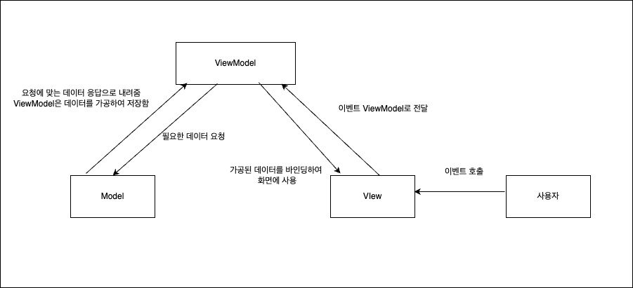

Vue.js 개발 공부를 하다 보니 디자인 패턴을 자연스럽게 접하게 되었고 좀 더 알아보고 싶은 마음에 공부를 하게 되었다. 

MVVM 패턴에 대해 공부한 내용을 같이 확인해 보자.

## 🏛️ **MVVM 패턴이란?**
Model-View-ViewModel 에 약자이다.

### Model
데이터와 비즈니스 로직을 담당한다.

데이터를 가져오고 저장하는 역할을 수행하며 데이터베이스, 네트워크 요청과 같은 데이터 소스와 상호작용을 한다.

> 데이터 소스란 
> 데이터를 생성하거나 제공하는 출처 

### View
레이아웃과 화면을 담당한다.

UI를 표시해주고 입력을 처리한다.

### ViewModel
View와 Model 사이의 중재자 역할을 담당한다.

View에 발생하는 이벤트를 감지하고 이벤트에 맞는 비즈니스 로직을 수행한다.

또한 Model과 상호작용하여  데이터를 가져오거나 수정하고며 가져온 데이터를 가공후 저장한다.

이러한 요소들이 어떤식으로 동작할까?

## ⚙️ **동작 방식**

1. 사용자의 이벤트 호출이 View로 들어온다.

2. View는 들어온 이벤트를 ViewModel로 전달한다.

3. 이벤트에 필요한 데이터를 Model에 요청한다.

4. Model은 요청에 맞는 데이터를 ViewModel에 응답으로 내려준다

5. ViewModel은 응답받은 데이터를 가공 후 저장한다.

6. View에서 데이터 바인딩을 사용하여 ViewModel에 가공된 데이터를 사용하게 된다.

이런식으로 View, Model, ViewModel이 동작하게 된다.

그렇다면 MVVM 패턴의 특징은 무엇일까??

## 💡 **MVVM 패턴의 특징**
### 데이터 바인딩
- View와 ViewModel이 **자동으로 동기화** 된다.
- View에서 데이터 변경시 ViewModel도 업데이트 처리된다.(반대 상황도 마찬가지)

### 역할 분리
- UI와 비즈니스 로직은 ViewModel을 통해 분리된다.
- 유지 보수성과 테스트 용이성이 향상된다.

## 🗂️ **정리**
MVVM 패턴은 Model, View, ViewModel 로 이루어져 있다.

Model: 데이터, 비즈니스 로직 담당

View: UI, 사용자 입력 처리 담당

ViewModel: Model과 View의 중재자 담당

## 💭 **느낀점**
Vue.js를 조금씩 공부하게 되면서 디자인 패턴들에 대한 내용을 접하다 보니까 궁금증이 생겨서 공부하게 되었는데 다른 디자인 패턴들도 공부해봐야겠다.