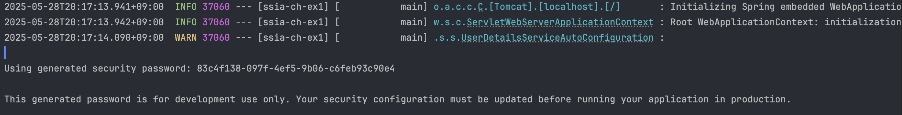
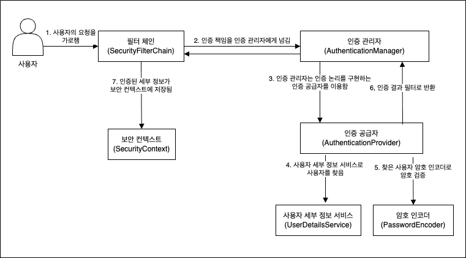

## 🗣️ **서론**
어제는 웹 보안에 취약성들에 대해 공부하였다.

오늘부터는 본격적으로 Spring Security에 대한 공부를 시작했다. 생각보다 Spring Security가 복잡하게 구성되어 있어서 시작부터 심상치 않았다.

## 🔐 **Spring Security란?**
Spring 프레임워크로 구성된 웹 백엔드에 보안과 관련된 요소를 손쉽게 제어하기 위한 Spring에 하위 프레임워크 중 하나이다.

보안에 핵심 요소인 **인증(Authentication)**,  **권한 부여(Authorization)** 를 쉽게 컨트롤하게 해주기 때문에 굉장히 많이 사용된다.

## 🔄 **Spring Security의 기본 흐름**
Spring Boot 프로젝트에 Spring Security 의존성을 추가하고 기타 설정없이 바로 구동시키면 정상 구동 시 아래와 같은 로그가 나오게 된다.

Spring Security는 아무런 설정이 없을 경우 기본적으로 Http Basic 인증 방식을 구성하여 제공한다.

### 🔑 **Http Basic이란?**
클라이언트가 서버에 요청을 보낼 때 ID(username) + 비밀번호(password) 조합을 base64 형태로 인코딩해서 Authentication 헤더에 태워서 보내는 방식이다.

기본 인증 방식으로 실제로는 최대한 사용을 피해야만하는 방식이다.

단점으로는 아래와 같다.
- 비밀번호가 평문으로 바로 노출됨. 
  - Base64는 인코딩 방식으로 암호화가 아니기 때문에 디코딩하면 바로 확인 가능
- 세션, 상태 모두 없음
  - 매 요청마다 이걸 계속 보내야함
- TLS, SSL 인증이 없을 경우 인증 방식이라는 말과 안어울리게 딸깍 한번으로 털릴 수 있음

이정도로 단점밖에 없는 인증 방식을 기본적으로 제공해준다.

> Http Basic을 굳이굳이 써야하는 상황이라면...아마 테스트 환경 정도..? 그냥 안쓰는게 제일 베스트이다.

이제 Spring Security의 큰 동작 흐름을 한번 살펴보자.

### 🌀 **동작 흐름**
Spring Security에 기본 동작 흐름은 아래와 같다.

1. 사용자가 요청을 보내면 필터 체인(`SecurityFilterChain`)에 등록된 여러 개의 `Filter`들이 순서대로 요청을 가로챈다.
2. 인증에 대한 책임을 인증 관리자(`AuthenticationManager`)에 넘긴다.
3. 인증 관리자(`AuthenticationManager`)는 인증 논리를 구현하는 인증 공급자(`AuthenticationProvider`)를 이용한다.
4. 인증 공급자(`AuthenticationProvider`)는 사용자 세부 정보 서비스(`UserDetailsService`)를 사용하여 사용자 정보를 조회한다.
5. 조회한 사용자 정보를 암호 인코더(`PasswordEncoder`)를 사용하여 암호값을 검증한다.
6. 인증 결과를 인증 필터(`Filter`)에 반환한다.
7. 인증된 세부 정보를 보안 컨텍스트(`SecurityContext`)에 저장한다.

이때, 기타 설정을 하지 않으면 아래 두 Bean이 자동으로 구성되어 설정된다.
- `UserDetailsService`: 사용자 세부 정보 조회
- `PasswordEncoder`: 암호 인코딩 및 암호화된 값 비교

## 🔥 **느낀점**
Spring Security에 기본 동작 원리에 대해 공부하였는데 생각했던 것보다 구조가 체계적이면서도 복잡해서 완전히 익히는데까진 시간이 걸릴 것 같다.

여태까지 사이드 프로젝트를 하면서 회원가입, 로그인 기능을 많이 개발해봤지만, 동작 원리를 제대로 이해하지 않고 기능 구현에만 집중을 했던게 조금 후회된다.

이렇게 복잡하고 어려울줄 알았으면 진작 좀 해둘걸 그랬다. 퇴근하고 매일매일 조금이라도 계속해서 공부하면 점점 더 많이 알게될 것이라고 생각한다.
