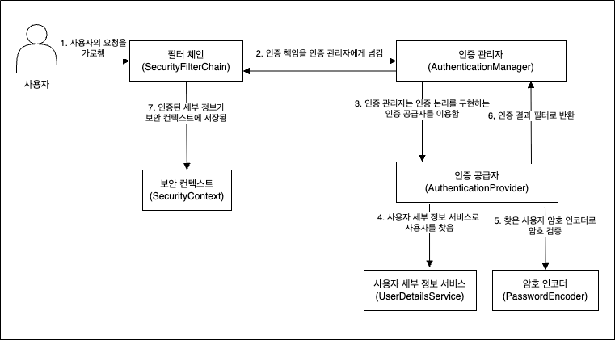

## 🗣️ **서론**
요즘 날씨가 장난이 아니다. 퇴근하고 집에 오면 그냥 찜통이 따로 없는거같다.
그래도 공부는 빼먹을 수 없겠지. 

오늘은 `UserDetailsService`, `PasswordEncoder`에 개념에 대해 자세하게 알아보자.

## 💡 **UserDetailsService와 PasswordEncoder**
먼저 `UserDetailsService`와 `PasswordEncoder에` 역할부터 알아보자.



위 그림처럼 `UserDetailsService와` `PasswordEncoder는` 아래와 같은 역할을 수행한다.
- `UserDetailsService`: 사용자 세부 정보 조회
- `PasswordEncoder`: 비밀번호 암호화 및 암호화된 비밀번호 비교

두 인터페이스의 역할은 아주 직관적이다.

흐름을 조금만 더 자세하게 살펴자.
1. 인증 관리자인 `AuthenticationManager`가 인증 공급자인 `AuthenticationProvider`에게 `Authentication` 인증 객체를 넘김
2. `Authentication을` 넘겨받은 `AuthenticationProvider는` 구현된 인증 논리대로 `UserDetailsService`를 호출하여 사용자 세부 정보(`UserDetails`)를 조회함
3. `UserDetails`에 등록된 비밀번호와 넘어온 비밀번호를 비교함
4. 인증 성공 시 `Authentication` 인증 객체에 인증 성공을 표시한 후 반환

`UserDetailsService`와 `PasswordEncoder`가 수행하는 역할은 매우 단순하다.

하지만 두 인터페이스 모두 없어서는 안되는 아주 중요한 요소이며, 인증 프로세스에서는 둘이 한 쌍이라고 생각하면 된다.

이제 두 인터페이스의 선언부를 살펴보자.

### 🔐 **UserDetailsService**
```java
package org.springframework.security.core.userdetails;

public interface UserDetailsService {
    UserDetails loadUserByUsername(String username) throws UsernameNotFoundException;
}
```

`UserDetailsService` 인터페이스는 선언된 메서드가 한가지 밖에 없다.

- `loadUserByUsername()` 메서드: 넘어온 사용자 ID 값을 통해 사용자 세부 정보를 조회한 후 반환한다.

> Spring Security에서는 사용자 ID를 username이라는 이름으로 사용된다.

### 🛡️ **PasswordEncoder**
```java
package org.springframework.security.crypto.password;

public interface PasswordEncoder {
    String encode(CharSequence rawPassword);

    boolean matches(CharSequence rawPassword, String encodedPassword);

    default boolean upgradeEncoding(String encodedPassword) {
        return false;
    }
}
```

`PasswordEncoder` 인터페이스에 정의된 메서드들은 3가지로 아래와 같은 역할을 수행한다.

- `encode()` 메서드: 비밀번호 값을 암호화
- `matches()` 메서드: 평문으로 넘어온 비밀번호 값과 암호화된 비밀번호 값이 일치하는지 검증
- `upgradeEncoding()` 메서드: 재암호화 필요 여부 확인

위 메서드들을 사용하여 개발자는 사용자 암호를 편리하게 관리가 가능하다.

자주 사용하는 PasswordEncoder에 구현체로는 BCrypt 암호화 방식을 사용하는 `BCryptPasswordEncoder`가 있다.

> BCrypt 암호화 방식은 Salt를 자동 생성하여 매번 다른 해시 결과를 반환해주며, SHA-256과는 달리 해시 속도가 느리게 설계되었기 때문에 대량 공격을 대응하기 편리하다는 장점이 있다.

## 🔥 **느낀점**
오늘은 매번 Security를 사용하여 개발할 때 항상 사용했던 `UserDetailsService`와 `PasswordEncoder`를 자세하게 알아보았다. 

어제 공부했던 Spring Security의 인증 프로세스를 다시 한번 복습해볼겸 자세하게 뜯어봤고 각 인터페이스의 역할을 자세하게 이해할 수 있었다.


